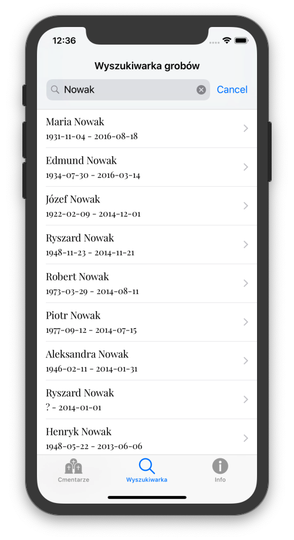

# Poznańskie Cmentarze - wyszukiwarka miejsc pochówku  
  
Technically the third version of my unfinished demo kinda app using no github libraries except for Swiftlint and R.swift  

 
 
- Quickly find graves of your relatives buried in Poznań.  
- Search using surnames or full names.  
- Find all cemeteries in Poznań.  
- Run Apple Maps to navigate to the location of the grave / cemetery  
 
